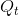

# EL2320 Applied Estimation 

## Lab 1

### PART I

### Linear Kalman Filter

 
 
1.**What is the difference between a ”control” u_t , a ”measurement” z_t and the state x_t ? Give examples of each!**

While a controll **u**_t is assumed to be exactly known we assume that a measurement **z**_t is perturbet with measurement noise. On the other hand the state **x**_t contains the values that are to be estimated using the controll and measurement. It is too assumed that the state itself is perturbed with disturbance noise. All noises are assumed to be gaussian with zero mean.

 
 
2.**Can the uncertainty in the belief increase during an update? Why (or not)?**

The uncertainty in the belief cannot increase during an update because  and  are p.s.d which means that  is p.s.d and so . This means that during an update the uncertainty in the belief is always decreasing.

 
 
3.**During update what is it that decides the weighing between measurements and belief?**

The weighting between emasurements and beief is decided by the Kalman gain  which depends from the covariances of system disturbances and measurement noise,  and .

 
 
4.**What would be the result of using too large a covariance (Q matrix) for the measurement model?**

Using a too large covariance matrix  leads to a small Kalman gain . In that way the measurements would be considered very little.

 

5.**What would give the measurements an increased effect on the updated state estimate?**

A relatively big  or relatively small  would give the measurements an increased effect on the updated state estimate.

 

6.**What happens to the belief uncertainty during prediction? How can you show that?**
  
During a prediction step  the belief uncertainty normally increases because  is p.s.d and  doesn't normally change the uncertainty alot compared to .
 One exception would be for example if A_t was a diagonal matrix with very low values. 

 

7.**How can we say that the Kalman filter is the optimal and minimum least squared error estimator in the case of independent Gaussian noise and Gaussian priori distribution? (Just describe the reasoning not a formal proof.)**
It gives the true posterior distribution for a linear Gaussian system and hast the lowest expected square error, so it is the optimal. Any other better mean is equal to the Gaussian mean.

 

8.**In the case of Gaussian white noise and Gaussian priori distribution, is the Kalman Filter a MLE and/or MAP estimator?**
In the case of Gaussian white noise and Gaussian priori distribution the Kalman Filter is a MAP estimator since it makes use of the prior.

**Extended Kalman Filter:**

 

9.**How does the Extended Kalman filter relate to the Kalman filter?**
  
The Extended Kalman Filter is the usage of Kalman Filter for linearized nonlinear systems. 

 

10.**Is the EKF guaranteed to converge to a consistent solution?**
  
The convergence of EKF to a consistent solution is not guaranteed.
The update depends on the previous estimate and an estimate implied by linearising the measurement function, if this linearisation is far from  , the measurement does not really imply   and the updated state can be moved to an unreal one. Therefore, the consistency depends on the significance of the nonlinearity where the function has been linearised.

 

11.**If our filter seems to diverge often, can we change any parameter to try and reduce this?**
  
We can increase the relative size of the measurement covariance, as divergence occurs most likely on update phase. If instead it is due to a poor data association, the matching threshold can be changed. Another possibility is increasing the sampling rate. 

**Localization:**

 

12.**If a robot is completely unsure of its location and measures the range r to a know landmark with Gaussian noise, what does the posterior belief of its location p(x, y, θ|r) look like? A formula is not needed but describe it at least.**
  
The robot will know that it is approximately at a distance r from the landmark but will not know in which direction. Since Gaussian distribution is not multimodal the posterior distribution would include all possible possitions which would correspond to a Gaussian distribution with mean at the landmark and variance big enough to include all possible location within r distance from landmark. The posterior of the angle would stay uniform. 

If the estimation was done for the polar coordinates the posterior belief would have the form of a donat which translates in a Gaussian distribution for the distance r and normal distribution for θ. 

 

13.**If the above measurement also included a bearing, how would the posterior look?**
  
If in addition to the distance the measurement included a bearing the robots location would be described by a Gaussian distribution with mean on the real location.

14.**If the robot moves with relatively good motion estimation (prediction error is small) but a large initial uncertainty in heading θ, how will the posterior look after traveling a long distance without seeing any features?**
  
The posterior would have the form of a circle since the distance travelled is known very good but the heading not.
If the uncertainty of the heading θ is not totally uncertain we would have a banana form of the posterior built by Gaussian ellipses.

 

15.**If the above robot then sees a point feature and measures range and bear-ing to it, how might the EKF update go wrong?**
The EKF update may go wrong since the linearization on the update step can be done repsectively to location which could be far away from the real position of the robot and which would make the update diverge. 

### PART II
#### Warm up

 

16.**What are the dimensions of  and  ? What parameters do you need to define in order to uniquely characterize a white Gaussian?**
  
The dimensions are [2x1] and [1x1] respectively. In order to uniquely define white Gaussian we need the covariance matrix and the mean which is normally 0 for white noise. 

17.**Make a table showing the roles/usages of the variables (x, xhat, P, G, D, Q, R, wStdP, wStdV, vStd, u, PP). To do this one must go beyond simply reading the comments in the code. Hint: Some of these variables are part of our estimation model and some are for sim-ulating the car motion.**

**Variable**  | **Role/usage**
------------ | -------------
x| The state to be estimated (position and velocity)
xhat| The estimated state
P| Belief uncertainty of estimated state (Covariance matrix)
G| Matrix which gives the linear combination how the noise influences the predict step
D| Matrix which gives the linear combination how the noise influences the measurements
Q| Covariance matrix of model noise in the measurement
R| Covariance matrix of model noise 
wStdP| Variance amplitude of the real normally distributed position noise
wStdV| Variancve amplitude of the real normally distributed velocity nose
vStd| Max amplitude of the real normally distributed measurement noise
u| Control signal used in the prediction step(no uncertainties)
PP| List of belief uncertainty matrixes

18.**Please answer this question with one paragraph of text that summarizes broadly what you learn/deduce from changing the parametersin the code as described below. Choose two illustrative sets of plots to include as demonstration.
What do you expect if you increase/decrease the covariance matrix of the modeled (not the actually simulated) process noise/measurement noise by a factor of 100 (only one change per run)? Characterize your expectations. Confirm your expectations using the code (save the corresponding figures so you can analyze them in your report).
Do the same analysis for the case of increasing/decreasing both parameters by the same factor at the same time. Hint: It is the mean and covariance behavior over time that we are asking about.**

Relativel increasing R corresponds to an increase in K and so a bigger consideration of the measurements. We can see this as agressivity property of the estimation. If R would be on the other hand small relatively to Q (or Q relatively big) the covergence(decreasing of P) and the mean would change much slower. In general we have a big covariance if both Q and R are big since the estimating is done under a high uncartainty.

 

<b>Fig 1. </b><a>Kalman Gains for different modelled noise covariances Q and R</a>

 

<b>Fig 2. </b><a>Uncertainty of the belief for different modelled noise covariances Q and R</a>

 
 

<b>Fig 3. </b><a>State estimation and corresponding error for different modelled noise covariances Q and R</a>

19.**How do the initial values for P and x̂ affect the rate of convergence and the error of the estimates (try both much bigger and much smaller)?**

An increase on P leads to a much bigger error in the beginning and a much faster convergence rate than P/100.
x̂ on the other hand doesn't change the convergence rate. It shows the initial position, so the close te the real initial position it is the faster it converges and so the smaller the error of the estimator. Otherwise, the further from the real initial position the bigger the error initially. In general this is much of a bigger problem in nonlinear systems, but this is fortunately not the case in our example.

   

<b>Fig 4. </b><a>Kalman Gains for different initial uncertainty(covariance matrixes P)</a>

   

<b>Fig 5. </b><a>Uncertainty of the belief for different initial uncertainty(covariance matrixes P)</a>

   

<b>Fig 6. </b><a>State estimation and corresponding error for different initial uncertainty(covariance matrixes P</a>

#### EKF Localization

20.**Which parts of (2) and (3) are responsible for prediction
and update steps?**
  
For the prediction step: the second equation in (3):   and for the update step: the first equation in (3): .

21.**In the Maximum Likelihood data association, we assumed
that the measurements are independent of each other. Is this a valid
assumption? Explain why.**

It is usually invalid assumption since for example a beam of a range scan are often not independent. 

22.**What are the bounds for δ_M in (8)? How does the choice
of δ_M affect the outlier rejection process? What value do you suggest for λ_M when we have reliable measurements all arising from features in our map, that is all our measurements come from features on our map? What about a scenario with unreliable measurements with many arising from so called clutter or spurious measurements?**

δ_M can take values between 0 and 1 as it is a probability. 
A high value would give a threshold for the Mahalanobis distance defining regions so far that the probability of being in that region  is very small, 1-δ_M, If there are many expected outliers, our scenario includes unreliable measurements, δ_M should be smaller so the outliers are rejected, if we expect no outliers because we have reliable measurements from features on our map δ_M would approach 1. That means λ_M big when we expect few outliers or none, and smaller when there are many unreliable measurements.

23.**Can you think of some down-sides of the sequential update
approach (Algorithm 3)? Hint: How does the first (noisy) measurement
affect the intermediate results?**
  
With sequential update the risk of diverging is higher since this individual measurements are noisy. After a first noisy measurement or an outlier we keep using the wrong estimation of the pose which is more likely to diverge. Whereas the batch update averages out the noise. 

24.**How can you modify Algorithm 4 to avoid redundant re-
computations?**

Exploit the symmetry of covariance matrixes.

25.**What are the dimensions of  and  in Algorithm 4?
What were the corresponding dimensions in the sequential update algorithm? What does this tell you?**
  
 has dimensions [MN x 1] and   has dimensions [MN x P], where N is the number of observations, M is the length of each measurement and P is the length of state vector.
In the sequential update the dimensions were [P x 1] and [MxP] respectively. This tells us that the complexity for the batch update is much bigger expecially for inversing the [MN x MN] matrix.

### Simulations

#### Dataset 1
For the first datasets we see that average errors are relative small which can very good be explained by the high accuracy of the measurements and encoders. Measurement and process noise should be modelled with low covariances.

  

<b>Fig 7. </b><a>Visalization and error statistics of dataset 1</a>

#### Dataset 2
The third dataset includes a high number of outlier measurements which have to be detected and avoided. That is why the threshold has to be properly be selected and batch update performed. Logically we see a bigger mean error in this case,, especially for the theta angle.

   

<b>Fig 8. </b><a>Visalization and error statistics of dataset 2</a>

#### Dataset 3
The third dataset distinguishes of the two others because of the different simulated noises. While association does not play a big role if turned off, once the batch update is turned off, the estimation deteriorates. Averaging off noise and outliers with batch update is vital in this case. 

   

<b>Fig 9. </b><a>Visalization and error statistics of dataset 3</a>

## Lab 2

### PART I

### Preparatory Questions

 
1.**What are the particles of the particle filter?**

States of the state space at which the posteriori probability density is estimated. In Localization another way is thinking of particles as possible locations of the robot.

 
2.**What are importance weights, target distribution, and proposal distribution and what is the relation between them?**
 
Target distribution is the probability distribution to be estimated, in other words the posteriori distribution. Proposal distribution is called the distribution we sample from, which makes use of the model. Importance weights adjust for the difference between the sampled distribution and the target distribution.

 
3.**What is the cause of particle deprivation and what is the danger?**

Particle deprivation happens when there are not enough particles to cover all the space. The dagner is that there may not be particles in vicinity of correct state.

 
4.**Why do we resample instead of simply maintaining a weight for each particle?**

Resampling makes sure that a redistribution of the particles to places of higher possibiliy takes place. In that way the computational power is concetrated in places of bigger importance.

 
5.**Give some examples of situations in which the average of the particle set is not a good representation of the particle set.**

The average is not a good representation always when the particles have not converged, i.e. when there re still outlier particles. One case is at the beginning when the uncertainty is still big and lots of particles have not yet converged. Another example comes from localization in symmetrical environments where the particles are distributed equally in different poses.

 
6.**How can we make inferences about states that lie between particles?**

Place a kernel(e.g. Gaussian kernel) around each particle and estimate the additive effect on the state of interest which than correspond to the density on that state. Other ways can be to fit a Gaussian to the mean and variance of particle set or form a histogram where state space is seperated in bin and each bin has a number of particles.

 
7.**How can sample variance cause problems and what are two remedies?**

This problem can manifest itself as a loss of diversity in the particle population which translates to an approximation error. Two major strategies for variance reduction include low variance sampling and sampling less frequently.

 
8.**For robot localization and a given quality of posterior approximation, how are the pose uncertainty (spread of the true posterior) and number of particles we chose to use related?**

The higher the number of particles we use the better can the posteriori probability estimation be done, i.e. the lower the uncertainty.

### PART 2

### Matlab Exercises

 
9.**What are the advantages/drawbacks of using (5) compared to (7)? Motivate.**

(5) assumes a constant angle and is so simplier whereas (7) includes the angle which is in the mean time part of the state. While more complicated (7) allows for the discription of more complicated models.

 
10.**What types of circular motions can we model using (8)? What are the limitations (what do we need to know/fix in advance)?**

Only circular motions with constant angular and linear velocity which need to be known in advance.

 
11.**What is the purpose of keeping the constant part in the denominator of (10)?**

It is kept for normalizing purposes to make sure that the likelihood is a probability distribution. 

 
12.**How many random numbers do you need to generate for the Multinomial re-sampling method? How many do you need for the Systematic re-sampling method?**

For the Multinomial re-sampling we need to generate M random variables whereas for the Systematic re-sampling only 1.

 
13.**With what probability does a particle with weight w =1/M +  survive the re-sampling step in each type of re-sampling (vanilla and systematic)? What is this probability for a particle with 0 ≤ w < 1/M? What does this tell you? Hint: it is easier to reason about the probability of not surviving, that is M failed binary selections for vanilla, and then subtract that amount from 1.0 to find the probability of surviving.**

A particle with weight w =1/M +  survives vanilla resampling with probability  and the systematic resampling with probabilty 1. For importance weight smaller than 1/M the survuval probability for the vanilla corresponds the already presented formula whereas for the sequential resampling the probabilty is w/1.
We can say that the probability to survive is proportional to the weight eventhough both methods follow different approaches.

 
14.**Which variables model the measurement noise/process noise models?**

 and  respectively.

 
15.**What happens when you do not perform the diffusion step?(You can set the process noise to 0)**

When the diffusion place doesn't take place the particles diverge.

 
16.**What happens when you do not re-sample? (set RESAM-PLE MODE=0)**

The particles do not converge.

 
17.**What happens when you increase/decrease the standard deviations(diagonal elements of the covariance matrix) of the observation noise model? (try values between 0.0001 and 10000)**

When observation noise covariance matrix is big the variance of the particles position stays big since all weights are approximately equally big from a certain point. On the other hand when the covariance matrix gets small allmost all particles have very small weights, but once a particle is very close to the real position the resampling tends to choose that particle many times and so all particles converge to the real position.

 
18.**What happens when you increase/decrease the standard deviations (diagonal elements of the covariance matrix) of the process noise model? (try values between 0.0001 and 10000)**

When the the covariance decreases a lot the process noise isn't considered enough which leads the particles movie in wrong directions. A higher covariance matrix of the process noise counts for any possible noise of the model. While the position of the particles have a bigger covariance their mean is still able to approximate the real position. If the process noise is made too big than the particle filter works as if there were no model and the estimations depends only on the measurements which would deverge in case of outliers or not modelled noise.

 
19.**How does the choice of the motion model affect a reasonable choice of process noise model?**

Wrong model is compensated with higher process noise.

 
20.**How does the choice of the motion model affect the precision/accuracy of the results? How does it change the number of particles you need?**

The not correct motion model would require a higher process noise which and so keeps a particle cloud with a bigger variance. In order to cover a bigger variance distribution the number of particles needed is bigger.

 
21.**What do you think you can do to detect the outliers in the third type of measurements? Hint: What happens to the likelihoods of the observation when it is far away from what the filter has predicted?**

Similiar to EKF we can use a threshold on the average likelihood of the observation from all particles to detect the outliers.

 
22.**Using 1000 particles, what is the best precision you get for the second type of measurements of the object moving on the circle when modeling a fixed, a linear or a circular motion (using the best parameter setting)? How sensitive is the filter to the correct choice of the parameters for each type of motion?**

Since the modeling of measurements noise doesn't depend on the motion model a 20x bigger (Lab2/Formulas/sigma_R.png) than the one given brings in the best results.
Using the fixed motion model we came to the conclusion that using a big enough is very important for the particles to not diverge. The best results were achieved for a  10x bigger than the one given.
On the other hand the linear and circular motion modell are stable. The best results for the linear motion modell are achieved for same modell noise covariance. Whereas for the circular motion modell a 20x smaller  than the given one is the best choice.

### Main problem

### Monte Carlo Localization

 
23.**What parameters affect the mentioned outlier detection approach? What will be the result of the mentioned method if you model a very weak measurement noise |Q| → 0?**

The outlier detection method is affected by the measurement noise covariance and the threshold. By modelling the measurement model with a very weak measurement noise, almost all measureents would be detected as outliers. This happens because the peaks are very tight and a smoll deviation from the right peak would force the likelihood to not pass the threshold.

 
24.**What happens to the weight of the particles if you do not detect outliers?**

If an outlier measurement is not detected the weights of the particles corresponding to these measurements are given more weights than they should which would give a wrong set of particles after the re-sampling.

<!--- #### Dataset 1-3

   

<b>Fig 1. </b><a>Visalization of dataset 2</a>

   

<b>Fig 2. </b><a>Visalization of dataset 3</a>
--->

#### Dataset 4

 
**How many valid hypotheses do you have for these 4 landmarks? Start with 1.000 particles. Does your filter keep track of all hypotheses reliably? How about 10.000 particles? What do you think is the reason? Try multinomial sampling. How well does it preserve multiple hypotheses? How well are your hypotheses preserved when you model stronger/weaker measurement noises?**

The global localization with 1000 particles tends to converge towards the wrong position as is shown in Fig 1.

  

<b>Fig 1. </b><a>Global Localization with 1000 particles on Dataset 4</a>

Observing Fig 2  we can say that global localization with 10000 particles has 4 valid hypothesis and it is not able to converge toward only one of them since the enviroment is perfectly symetric respective to the place from where the measurements are taken

   

<b>Fig 2. </b><a>Global Localization with 10000 particles and systematic resampling on Dataset 4</a>

On the other hand, using multimonial resampling does not preserve the 4 hypothesis as it is more biased to choose particle of higher weight

   

<b>Fig 3. </b><a>Global Localization with 10000 particles and withmultinomial resampling on Dataset 4</a>

Changing the measurement noise models also affects the hypotheses preservation. Figure 4 shows the results for stronger measurement noise and Figure 5 for very weak noise. For stronger noise the hypotheses are preserved although are more spread. For weaker noise the hypotheses disappear fast and in this case  converge to the correct one. The reason may lie in the fact that the landmarks don't form a real square but rather a rectangle which can be considered if the measurement are very good and we model them with very low noise at the same time.

   

<b>Fig 4. </b><a>Global Localization with 10000 particles and strong measurement noise on Dataset 4</a>

   

   

<b>Fig 5. </b><a>Global Localization with 10000 particles and weak measurement noise on Dataset 4</a>

#### Dataset 5

**Does your filter converge to the correct hypothesis? Include in your report an image just before and just after the convergence.**

The filter is able to converge only after breaking the symmetry when observing the outlier on the right at second 37.

   

<b>Fig 6. </b><a>Global Localization with 10000 particles and default settings on Dataset 5</a>

