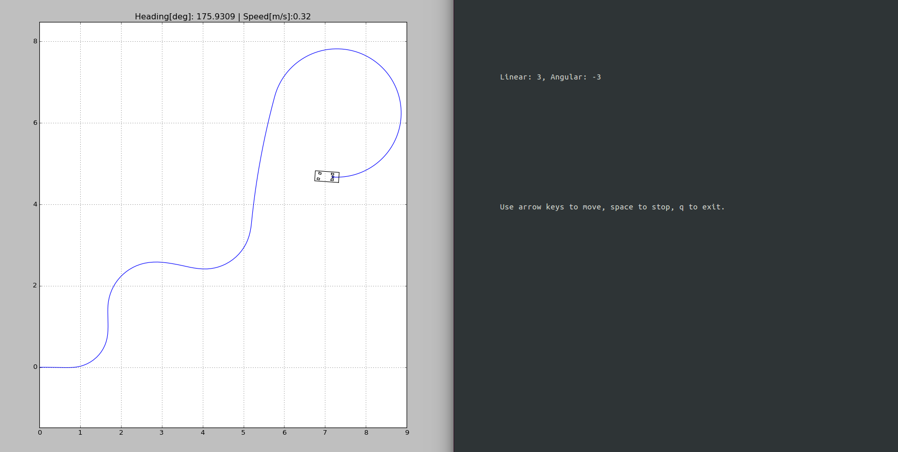
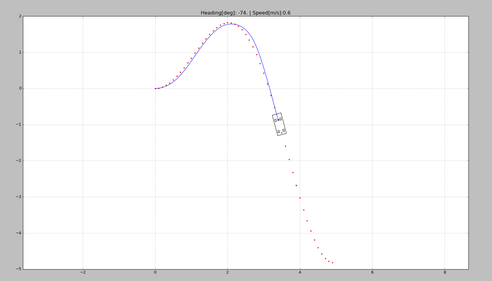
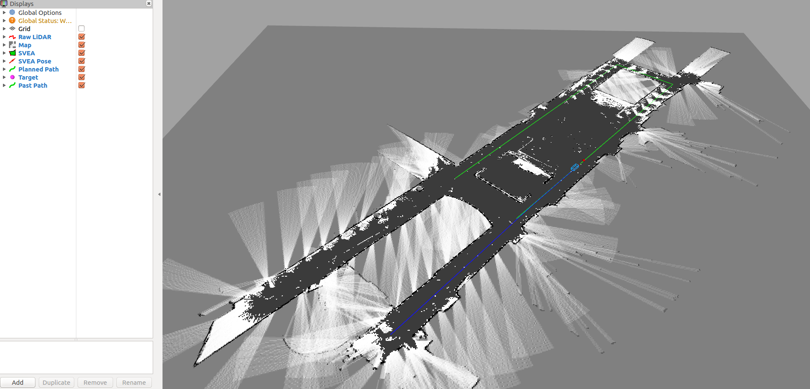

# Week 2

## Emergency brake (Mustafa & Karl)


## Limited speed (Mikel, Mikael, Subbu)
| New Files | Path |
| ------ | ------ |
| The constraint interface |[constraints_interface.py](src/svea/src/controllers/constraints_interface.py) |
| Controlling node |[velocity_constraint.py](src/svea/src/scripts/real/velocity_constraint.py)
| The launch file |[week2.launch](src/svea/launch/week2.launch)


# Week 3
| New Files | Path |
| ------ | ------ |
| advanced_controll | [Cadv](src/svea/src/PyAdvancedControl) |


# Constraint interface on TX2 signa
| New Files | Path |
| ------ | ------ |
| The new constraint interface |[constraints_interface.py](src/svea/src/controllers/constraints_interface_keyboard.py) |
| Controlling node |[sim_SVEA_keyboard_constraint.py](src/svea/src/scripts/sim/sim_SVEA_keyboard_constraint.py) |
| The launch file |[week2_keyboard.launch](src/svea/launch/week2_keyboard.launch)
| Keyboard Teleop |[key_teleop.py](src/teleop_tools/key_teleop/scripts/key_teleop.py) |

In order to run one has first to start the launch file and than "rosrun key_teleop key_teleop.py".
The second step is uneccessary if you uncomment the line where key_teleop node is actived in the launchfile.

## The new constraint interface ([constraints_interface.py](src/svea/src/controllers/constraints_interface_keyboard.py) )
The following functions are changed in the new interface compared to the old constraint interface:

+  **def start(self)** a thread fo only for the PID control is started
+  **def control(self)** the control function which is run in the thread all the time with 20Hz rate. It controlls corresponding to the input_* values which are updated by the function below. In this place we perform the breaking to, as explained two functions below.
+  **def send_constrained_control** updates the input_* values for the controll function to work properly. It has to be called from the respective node, in this case the [sim_SVEA_keyboard_constraint.py](src/svea/src/scripts/sim/sim_SVEA_keyboard_constraint.py).

+  **def control_error(self)** added function from the brake class. In this way the interface is able to perform emergency breaking in the control function.
+  **def limited_velocity(self)** similiar to above it is imported from the breaking class.


## The controlling node ([sim_SVEA_keyboard_constraint.py](src/svea/src/scripts/sim/sim_SVEA_keyboard_constraint.py) )

It starts the constraints interface and subscribes to the topic /key_vel, where it reads the commands given from the keyboard through the node [key_teleop.py](src/teleop_tools/key_teleop/scripts/key_teleop.py). It than sends those commands through the constraint interface, which are PID controlled in the background.


## Unsolved Problems

+ Once in front of an obstacle it isn't alway able to move back again. Maybe i wrongly merged the brake class in the constraint interface class. The problem should be solved inside the [constraints_interface.py](src/svea/src/controllers/constraints_interface_keyboard.py) file.

```bash
sudo apt-get install ros-kinetic-robot-localization \
		     ros-kinetic-mrpt-map \
		     ros-kinetic-mrpt-navigation \
		     ros-kinetic-urg-node
```

## Installing the library
Start by going to the folder where you want the code to sit using terminal.
For example, choose the home directory or a directory for keeping projects in.
Once you are in the chosen directory, use the command:

```bash
git clone https://github.com/KTH-SML/svea_starter
```

to download the library. Then, a new directory will appear called
"./svea_starter". Go into the directory with command:

```bash
cd svea_starter
```

Finally, compile and link the libraries using:

```bash
catkin_make
source devel/setup.bash
rospack profile
```

To make sure the libraries are linked in the future, also call:

```bash
echo "source <path-to-svea-starter>/devel/setup.bash" >> ~/.bashrc
source ~/.bashrc
```

where you need to replace "\<path-to-svea-starter\>" with the file path to
wherever you cloned "svea_starter". For example, the full path might look like
"/home/nvidia/avtct/devel/setup.bash". **Note, you only need to do this once.**

# Usage

The intended workflow with the code base is as follows:
1. Write new features/software
2. Debug the new contributions in simulation
3. Perform basic tuning and adjustments in simulation
4. Evaluate actual performance on a SVEA car

The simulated vehicles provide identical interfaces and information patterns
to the real SVEA cars, thus by following this workflow, most development work
can be done in simulation and code can be directly ported to the real cars with
little effort.

There are two pre-written scripts to serve as examples of how to use the
code base in simulation. See and read the source code in
"svea_starter/src/svea/src/scripts/sim".

You can try them out by running one of the two commands:

```bash
roslaunch svea keyteleop.launch
```

for a keyboard teleop example. Once launched, you should see the following:



where you can use arrow keys to control the simulated SVEA car.

For a pure pursuit example, call:

```bash
roslaunch svea pure_pursuit.launch
```

where you should see something that looks like:



To run a more involved example, call:

```bash
roslaunch svea floor2_sim.launch
```

where you should see something that looks like:



## Going from simulation to real

Since the simulated SVEA cars are built to function very similarly to the real
SVEA cars, the transfer from simulation to real vehicles is fairly simple!

### Low-level Interface Setup

To your roslaunch file, add

```xml
<!--open serial connection for controlling SVEA-->
<node pkg="rosserial_python" type="serial_node.py" name="serial_node">
    <param name="port" value="/dev/ttyACM0"/>
    <param name="baud" value="250000"/>
</node>
```

Then, you just have model mismatch to deal with.


### Sensor setup

To grant the necessary permissions for the NVIDIA TX2 to comunicate with the IMU, run: 

```bash
sudo bash <svea_starter_root>/src/svea_sensors/grant_i2c_permisions.sh
```

If you are not using Qualysis or another motion capture system, and need localization, you need to setup the ZED ROS wrapper and add persmisions for the IMU.

Get the ZED ROS wrapper:
```bash
cd <svea_starter_root>/src
git clone https://github.com/stereolabs/zed-ros-wrapper.git
```

For the ZED ROS wrapper to work, you run ```catkin_make``` again after cloning the directory. The ZED ROS wrapper will *not* be included in the svea_starter by default since it requires dependencies that may not run on all computers easily. If you have problems with the compilation of the ZED ROS wrapper, refer to their [github repo](https://github.com/stereolabs/zed-ros-wrapper)'s README.

There are several options for SLAM/localization shown in ```svea_starter/src/svea_sensors/launch/```. For even more options, explore [mrpt_navigation](http://wiki.ros.org/mrpt_navigation).

### RC Remote

When the RC remote is not in override mode, it's inputs will still be received by the SVEA platform. This gives you the opportunity to use the remote in your project scripts, whether it's for debugging, data collection, or even imitation learning. The RC input is published to ```/lli/remote```.

### Listening to ROS on another computer

Since you will not be able to drive the SVEA cars with a display plugged in, it can be useful to link a computer that does have a display to the SVEA car's ROS network. This will let you use [RVIZ](http://wiki.ros.org/rviz) and [PlotJuggler](http://wiki.ros.org/plotjuggler) on the computer with a display while accessing the data streams on the SVEA car. This amounts to telling the computer with a display where the ROS master it should be listening to (in this case, it should listen to the ROS master running on the SVEA car) is located on the network. On both the SVEA car and the computer with a display, run:

```bash
. <svea_starter_root>/scripts/export_ros_ip.sh
```

You can test if this worked by launching something on the SVEA car in the same terminal where the export commands were run and then calling ```rostopic list``` on the computer with a display in the same terminal where the export commands were run. You should see the topics you expect to be on the SVEA car also available on the computer with a display. If this worked, you have some options for how you want to use it. You can either:
1. call this script everytime you want to link the SVEA car and the computer with a display togther (the script only links the terminal window you run it in),
2. add an [alias](https://mijingo.com/blog/creating-bash-aliases) to the end of the SVEA car and the computer's ```~/.bashrc``` to create a new bash command,
3. you can add the contents of ```export_ros_ip.sh``` directly to the end of your ```~/.bashrc```,

or some other preferred approach.

## Documentation

There is documentation available for the current SVEA API. To access it open
docs/\_build/index.html in your favorite browser.
